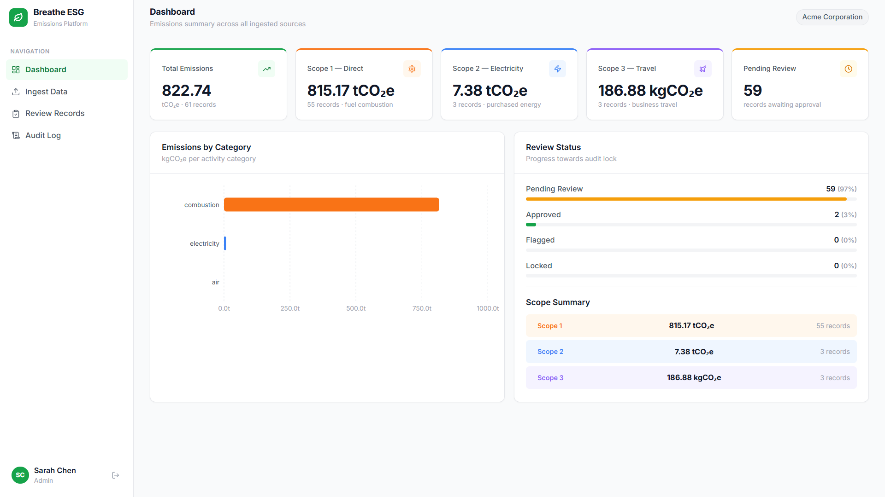
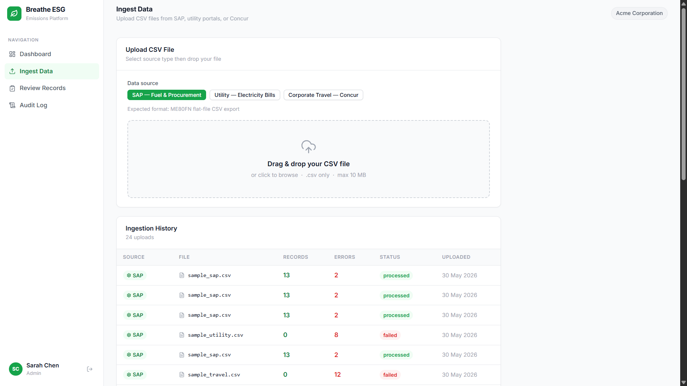
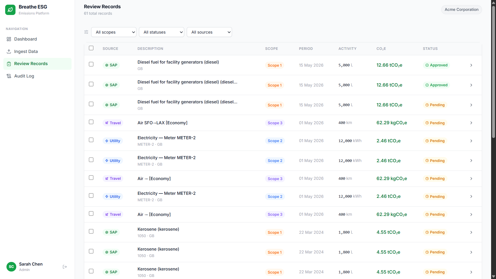
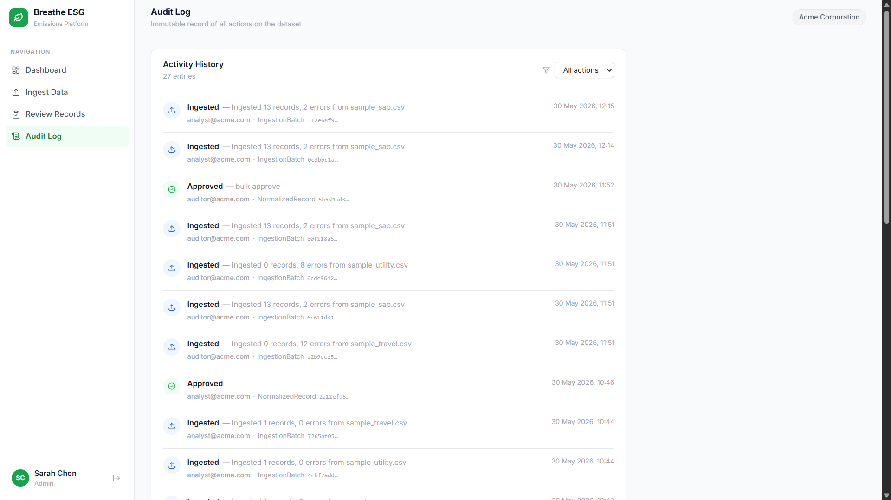

# Breathe ESG — Emissions Data Ingestion Platform

A Django REST + React application that ingests emissions-relevant activity data from three real-world sources, normalizes it into a unified GHG accounting model, and surfaces an analyst review dashboard where rows can be approved, flagged, and locked before audit.

**Live Demo**: [Frontend URL](https://breathe-esg-gold.vercel.app) | **API Health Check**: [Backend URL](https://breathe-esg-w0za.onrender.com/api/health/)

**Demo accounts** — password `breathe123` for all:
- `analyst@acme.com` (Analyst) — upload, approve, flag
- `admin@acme.com` (Admin) — all analyst actions + lock records
- `auditor@acme.com` (Auditor) — read-only

---

## User Interface

### Dashboard



### Ingest Data



### Review Records



### Audit Log

  

---

## What It Does

- **Ingests** CSV files from SAP (fuel/procurement), utility portals (electricity), and Concur (travel)
- **Normalizes** units, converts to kgCO₂e using UK DEFRA 2024 factors
- **Classifies** each record as Scope 1, 2, or 3 per GHG Protocol
- **Tracks** source-of-truth (raw records preserved immutably)
- **Review workflow**: Analysts approve/flag records; admins lock for audit
- **Audit log**: Every action logged immutably

---

## Architecture

```
backend/          Django REST Framework + PostgreSQL (Supabase)
frontend/         React + Vite → deployed on Vercel
sample_data/      Three realistic CSV files for testing
```

**Deployment**: Backend on Render (gunicorn), Frontend on Vercel, Database on Supabase PostgreSQL.

---

## Local Development

### Backend

```bash
cd backend
python -m venv venv
venv\Scripts\activate        # Windows
pip install -r requirements.txt

# Create .env file (required — otherwise DEBUG defaults to False)
copy .env.example .env      # Windows
# Edit .env and set DEBUG=True (already set in .env.example defaults)

python manage.py migrate
python manage.py seed_data   # creates demo org + 3 users
python manage.py runserver
```

API runs at `http://localhost:8000`

### Frontend

```bash
cd frontend
npm install
npm run dev
```

UI runs at `http://localhost:5173`

---

## Sample Data

Upload these CSVs from `sample_data/` via the Ingest page:

| File | Source Type | Rows | Notes |
|------|-------------|------|-------|
| `sample_sap.csv` | SAP | 13/15 | 2 intentional error rows |
| `sample_utility.csv` | Utility | 8/8 | 1 estimated reading flagged |
| `sample_travel.csv` | Travel | 10/12 | 2 error rows (bad IATA, 0 distance) |

---

## API Endpoints

| Method | Endpoint | Description | Roles |
|--------|----------|-------------|-------|
| POST | `/api/auth/token/` | Login → JWT | All |
| GET | `/api/auth/me/` | Current user | All |
| POST | `/api/ingestion/upload/` | Upload CSV | analyst, admin |
| GET | `/api/ingestion/batches/` | Ingestion history | All |
| GET | `/api/ingestion/records/` | All normalized records (filterable) | All |
| PATCH | `/api/ingestion/records/{id}/` | Edit record | analyst, admin |
| POST | `/api/ingestion/records/{id}/approve/` | Approve | analyst, admin |
| POST | `/api/ingestion/records/{id}/flag/` | Flag with note | analyst, admin |
| POST | `/api/ingestion/records/{id}/lock/` | Lock for audit | **admin only** |
| POST | `/api/ingestion/records/bulk-approve/` | Bulk approve | analyst, admin |
| GET | `/api/ingestion/records/summary/` | Aggregated kgCO₂e by scope | All |
| GET | `/api/ingestion/audit-log/` | Audit trail | All |
| GET | `/api/health/` | Health check | Public |

---

## Render Deployment (Backend)

1. Create a new **Web Service** on Render, connect this repo
2. Set **Root Directory**: `backend`
3. Set **Build Command**: `./build.sh`
4. Set **Start Command**: `gunicorn breathe_esg.wsgi --log-file -`
5. Add environment variables:
   - `DATABASE_URL` — Supabase PostgreSQL connection string (use Transaction pooler URL)
   - `DJANGO_SECRET_KEY` — generate with `python -c "import secrets; print(secrets.token_urlsafe(50))"`
   - `ALLOWED_HOSTS` — your Render domain, e.g. `breathe-esg.onrender.com`
   - `CORS_ALLOWED_ORIGINS` — your Vercel URL, e.g. `https://breathe-esg.vercel.app`
   - `DEBUG` — `False`

After deploy, create users via the admin at `/admin/` or run `seed_data` via Render shell.

## Vercel Deployment (Frontend)

1. Import the repo to Vercel
2. Set **Root Directory**: `frontend`
3. Add environment variable: `VITE_API_URL` = your Render backend URL
4. Deploy — Vercel auto-detects Vite

---

## Documentation

- [`MODEL.md`](./MODEL.md) — Data model, ER diagram, field rationale, multi-tenancy
- [`DECISIONS.md`](./DECISIONS.md) — What we chose, why, and what we'd ask the PM
- [`TRADEOFFS.md`](./TRADEOFFS.md) — Three things deliberately not built
- [`SOURCES.md`](./SOURCES.md) — Real-world format research per source

---

## Tech Stack

| Layer | Technology |
|-------|-----------|
| Backend | Django 5.2, Django REST Framework 3.17 |
| Auth | djangorestframework-simplejwt (JWT) |
| Database | PostgreSQL (Supabase) / SQLite (local) |
| Frontend | React 18, Vite 5, Recharts, react-dropzone, lucide-react |
| UI Theme | Light theme, Inter font, CSS custom properties |
| Deployment | Render (backend), Vercel (frontend) |
| Factors | UK DEFRA 2024 GHG Conversion Factors |

---

## License

MIT License - See [LICENSE](./LICENSE.md) file for details
